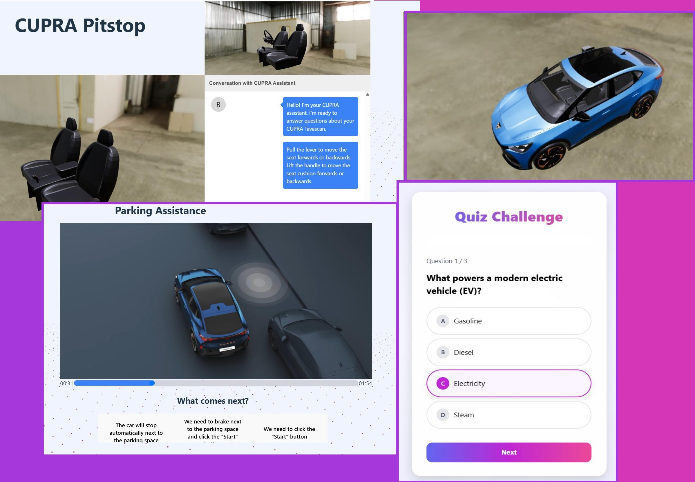

# CUPRA Pitstop



## How to use
Put your 3D models at: `public/models/`  
Put your videos at: `videos/`  
Put your video quizzes at: `data/videoQuizzes.json`

Install the dependencies:
```
npm i
```
Run the app:
```
npm run dev
```
Access the app at `http://localhost:5173/`

## Inspiration
We noticed that many drivers including our own parents often ignore the driver’s manual and struggle to adapt to the advanced features of modern vehicles. Today’s cars, like the Cupra Tavascan, are far more complex than older models. When we saw this challenge from Cupra, we knew it was the perfect opportunity to build something that bridges this knowledge gap in a user friendly, engaging way.

## What it does
CUPRA Pitstop helps new Cupra Tavascan owners get excited and educated about their car before it even arrives. Through gamified learning, users interact with visual puzzles and 3D models of vehicle components, explore how each part works, and then test their knowledge through quizzes. High scores earn them EV charging credits, turning learning into a rewarding experience.

## How we built it
We built the frontend with HTML, CSS, and JavaScript, and integrated Three.js for dynamic 3D modeling to provide a more immersive learning experience. We also customized a Gemini-powered chatbot to use Retrieval Augmented Generation (RAG) on the Cupra Tavascan driver guide to answer questions and guide users throughout the process.

## Challenges we ran into
Everything was new to us; From integrating a generative chatbot to implementing 3D models. We had to rapidly learn these technologies and adapt them in a way that prioritizes the user experience. Despite the steep learning curve, we’re proud of how we pulled it all together in such a short time.

## Accomplishments that we're proud of
We successfully brought our original vision to life with a working proof of concept. More importantly, we created something that has real potential to solve a problem we've seen firsthand. Knowing that our app could truly help users and bring value to companies like Cupra made the effort incredibly meaningful.

## What we learned
Beyond the technical skills, one of our biggest takeaways was understanding the importance of designing from the user’s perspective. We realized that making complex systems approachable requires not just functionality, but empathy and creativity.

## What's next for get guided
We believe CUPRA Pitstop has strong potential to be integrated into actual customer onboarding workflows. We plan to continue developing the app, refining its features, and exploring partnerships with automotive companies to bring this experience to real users.

## Team Members
- Jin Park
- Amritpal Singh
- Mustapha El Aichouni
- Eric López

